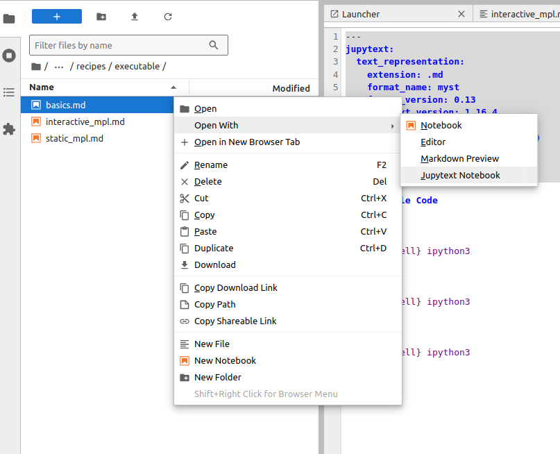

# Guide to Contributing

## What makes a "Recipe?"

Each recipe should:

* Be self contained
* Include a list of "ingredients" i.e. which parts of the bluesky framework you need and what data you need
* Be a markdown document
* Be categorised as a [tutorial or how-to guide](https://diataxis.fr/)
* Tagged
  * User
  * Developer
  * Admin
  * Manager
First, clone this repository.

With HTTPS:

```sh
git clone https://github.com/bluesky/bluesky-cookbok
```

With SSH:
```sh
git clone git@github.com:bluesky/bluesky-cookbok
```

## Overview

Each "recipe" is a directory under `docs/tutorials/` or `docs/how-to/`. It may
contain one or more Markdown (`.md`) files with a mixture of narrative text and
code. Each recipe directory may also contain supporting data files, scripts,
illustrations, solutions to exercises, etc.

```none
$ tree docs/
docs/
├── conf.py
├── contributing.md
├── index.md
├── tutorials
│   ├── getting-started
│   │   ├── hello-bluesky.md
│   ├── flyscanning
│   │   ├── basic-demo.md
...
```

Some of these Markdown files include a header that describes how to convert
them into Jupyter notebooks and execute the code in them. This is described in
more detail below.

## Setup

We use the [pixi](https://pixi.sh/latest/#installation) package manager to
create an environment with dependencies from conda-forge and PyPI. We recommend
installing pixi. Then just:

```sh
pixi install
```

But if you have a strong preference for a different package manager, peek
inside `pixi.toml` to find the list of dependencies and install them however
you wish.

## Build

```sh
pixi run build
```

```{note}
Later, if the build results get into a broken state, use `pixi run clean`
to start fresh.
```

This creates:
- Executed notebooks, generated from eligible Markdown files, under `build/juptyer_execute/`
- HTML under `build/html/`

Open `build/html/index.html` in a web browser.

## Develop

```
pixi run jupyter lab
```

In the file browser, locate one of the examples under `docs/recipes/`. Double
click to open.

Files like `docs/recipes/static/static.md` are plain Markdown files. Files like
`docs/recipes/executable/basics.md` have a YAML header which enables the
documentation build system to convert them to Jupyter notebooks and execute
them:

```yaml
---
jupytext:
  text_representation:
    extension: .md
    format_name: myst
    format_version: 0.13
    jupytext_version: 1.16.4
kernelspec:
  display_name: Python 3 (ipykernel)
  language: python
  name: python3
---
```

One option is to simply edit these files in any text editor.

Another is to use Jupyter Lab, which can open these files _as notebooks_
enabling you the interactively edit and execute them, saving the changes to
Markdown.



Note that the cell _outputs_ are not saved to disk. This is a feature, not a
bug: the outputs are build products, and they do not belong in version control.
During the build process, the Markdown document is converted to a Jupyter
notebook format and executed.

## Test

The script `test.sh` runs files with executable code from top to bottom and
prints any unexpected tracebacks.

```
pixi run ./test.sh docs/recipes/executable/basics.md
```

`````{note}

Sometimes examples are _expected_ to raise an exception. These can be marked up
with a "tag" like so. With that tag, the build and test procedures will pass
over the exception.

````markdown
```{code-cell} ipython3
:tags: [raises-exception]

1 / 0
```
````
`````

To test _all_ examples, run:

```
pixi run ./test.sh --all
```

(Above, the script automatically discovers all Markdown files which have that
YAML header marking them as executable.)

## Deploy

Once changes are merged to the `main` branch, the GitHub Actions [Publish workflow][] will:
- Publish HTML to this site.
- Uploaded the executed ipynb notebooks as a GitHub Artifact (useful for debugging)
  as an Artifact associated with the workflow run.
- Push to [the `notebooks` branch of this repository][notebooks-branch] a version
  where all Markdown Jupytext files have been converted to `.ipynb` format, using
  `pixi run ./convert-all ipynb`. This is suitable for use in environments
  where users need to be handed Jupyter Notebook files directly, such as Google
  Colab.

[notebooks-branch]: https://github.com/bluesky/bluesky-cookbok/tree/notebooks/docs/recipes
[Publish workflow]: https://github.com/bluesky/bluesky-cookbok/actions/workflows/cd.yml
