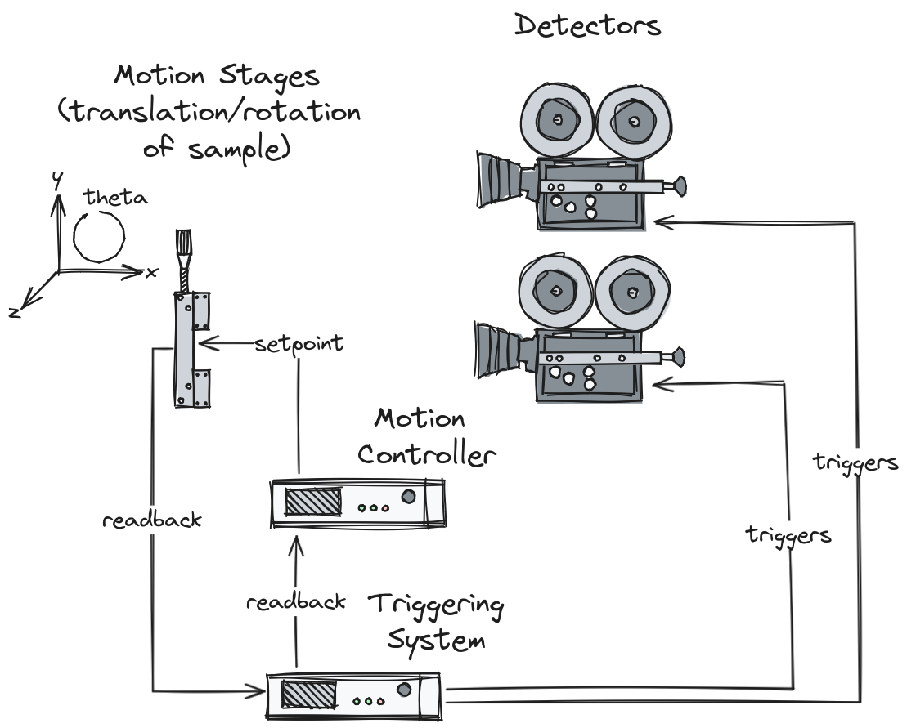

# Flyscanning

## Definition

Flyscanning (also known as hardware triggered scanning, asynchronous acquisition, and hardware synchronized scanning) is the practice of accelerating the rate of data collection by handing control over to an external hardware system that can control and synchronize the triggering of detectors with other signals and/or commands. Flyscans take many forms.

## Detector Synchronization

A triggering system can send pulses to two or more detectors to make them expose simultaneously, or at different multiples of the same base rate (e.g. 200Hz and 400Hz).

## Motor Trajectory Scanning

The triggering system can be configured to trigger the detectors at the same time as the motion controller commands the motors to go to certain points, or even exactly when they reach those points, using the readback values. This can be achieved on the scale of microseconds/nanoseconds, in comparison to traditional soft scans controlled via a network, which normally synchronize on the scale of seconds.

## Outer Scanning

Outer scans are flyscans nested inside soft scans.

In the example above a 2D grid scan in `x` and `y` is repeated in a third dimension: `z`. Given that `z` only needs to move for every 1 in every 25 points, it could be synchronized via software rather than hardware without significantly affecting scan time (and saving the effort/expense of wiring it into a triggering system). It then becomes the responsibility of the software to move `z`, hand control to the external hardware, wait for one grid's worth of points, take control back, and repeat.
