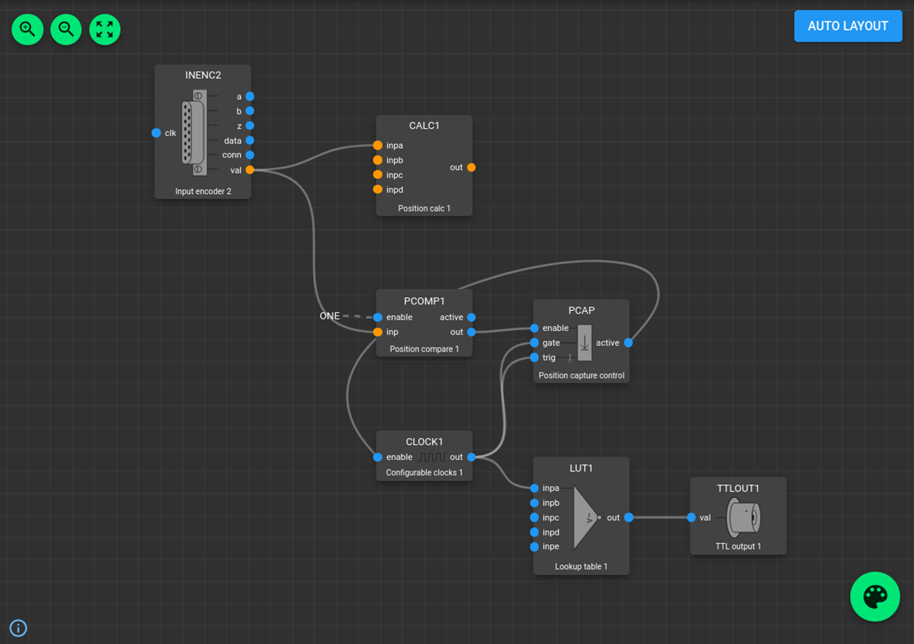

# Setup: PandA
[PandA](https://github.com/PandABlocks/PandABlocks-FPGA) is an open-source project with extensive and well-maintained [documentation](https://pandablocks.github.io/PandABlocks-FPGA). It provides a flexible set of **PandABlocks** — modular building blocks that can be combined to configure beamline-specific position capture, triggering, and control circuits.

* Before building any configuration, ensure that the correct [firmware](./setup-fw.md) is installed on your device.

* Open your preferred web browser and access the **PandA Web UI** using the device’s IP address or DNS name.

* To browse through available blocks, click the **Palette** icon located in the lower-right corner of the main page.
  The block names are intuitive and correspond to their function — for example, `INENC1` represents *Input Encoder 1*.

* Each block object has a list of configurable **properties** displayed in the panel on the right when selected.
  Blocks also have **input** and **output** ports that can be connected by clicking and dragging between them.
  Ports that carry digital (“bit”) signals are shown in blue and can be linked directly.

* **Build your configuration:** drag and drop the required blocks onto your workspace, adjust their parameters, and connect them to implement your desired functionality.

* **Save and upload:** when you save your design, it is stored as an `.ini` configuration file. After uploading, the PandA immediately runs the design.
  On startup, the instrument automatically restores this configuration, activating the selected hardware modules and interconnections.

For more details, refer to the [PandABlocks native documentation](https://pandablocks-fpga.readthedocs.io/en/latest/index.html).

Here is an example of the for the time-based XAS with an inverted TTL output for xspress3.

